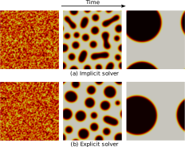
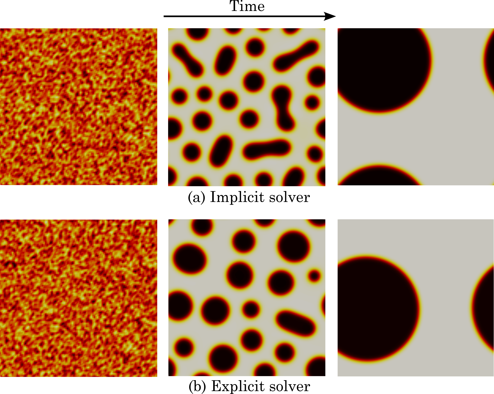
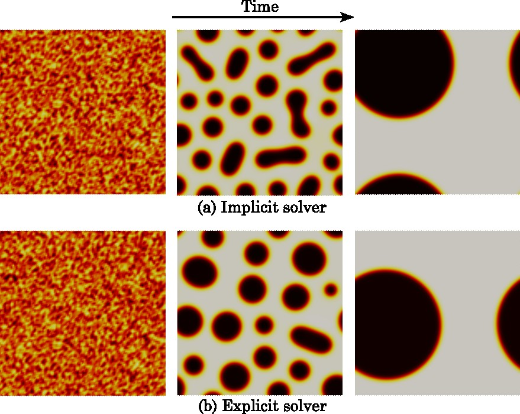

# Tutorial II · 2‑D Cahn Hilliard Equation


In this example we focus on:

1. How the **Residual** and **Tangent** functions differ between explicit and implicit time stepping  
2. Minimal IGA setup common to both variants  
3. Comparing results


## 1 · Problem description 

* 2-D periodic square Ω = [0,1]²  
* Order-parameter \(c(\mathbf x,t)\) representing concentration (0 ≤ c ≤ 1)  
* Temperature ratio θ = 1.5, interface-parameter α = 3000  
* Mobility \(M(c)=c(1-c)\)  
* Random initial condition with mean \( \bar c = 0.63\)


---


## 2 · Strong form

The Cahn–Hilliard system couples a **conserved** order parameter \(c\) with its chemical potential \(\mu\):

\[
\begin{aligned}
\frac{\partial c}{\partial t} &= \nabla\!\cdot\!\bigl(M(c)\,\nabla\mu \bigr), 
\\[4pt]
\mu &= \frac{\partial\Psi}{\partial c} \;-\; \alpha\,\theta\,\nabla^{2}c,
\end{aligned}
\]

where  

\[
\Psi(c) = \tfrac12 \theta\,\bigl[c\ln c + (1-c)\ln(1-c)\bigr] + \theta\,c(1-c)
\]

yields  

\[
\frac{\partial\Psi}{\partial c}
\;=\;
\tfrac12\theta \ln\!\left(\frac{c}{1-c}\right)+\theta\,(1-2c).
\]

Boundary conditions are **periodic**; source term \(q=0\).


## 3 · Code structure overview

Download the codes from [cahnHiliard](files/cahnHilliard.zip)

| File | Purpose |
|------|---------|
| `ch2d_explicit.c` | explicit Euler (`TSEULER`) – **Residual only** |
| `ch2d_implicit.c` | implicit (`TSALPHA`, or `TSTheta`) – **Residual + Tangent** |
| `run.sh` | batch script template |

> We show only the parts that differ between the two builds—everything else (domain, axis settings, initial condition, monitors) is shared.

---


### 3.1 Explicit variant – Residual only

```c
/* ---------------- Residual for explicit solver ---------------- */
PetscErrorCode Residual(IGAPoint p,
                        PetscReal t,const PetscScalar *U,
                        PetscScalar *R,void *ctx)
{
  AppCtx *user = (AppCtx *)ctx;

  /* c,  ∇c,  ∇²c  */
  PetscScalar  c, gradc[2], del2c;
  IGAPointFormValue (p,U,&c);
  IGAPointFormGrad  (p,U,&gradc[0]);
  IGAPointFormDel2  (p,U,&del2c);

  /* mobility and d(mu)/dc */
  PetscReal M,dM;
  Mobility(user,c,&M,&dM,NULL);

  PetscReal dmu;
  ChemicalPotential(user,c,NULL,&dmu,NULL);

  /* weak form */
  const PetscReal (*N0)    = (typeof(N0)) p->shape[0];
  const PetscReal (*N1)[2] = (typeof(N1)) p->shape[1];
  const PetscReal (*N2)[2][2] = (typeof(N2)) p->shape[2];

  PetscInt a, nen = p->nen;
  for (a=0; a<nen; a++) {
    PetscReal Na_x  = N1[a][0];
    PetscReal Na_y  = N1[a][1];
    PetscReal Na_xx = N2[a][0][0];
    PetscReal Na_yy = N2[a][1][1];

    PetscScalar Ra  = 0.0;
    PetscScalar t1  = M*dmu + dM*del2c;

    Ra -= (Na_x*gradc[0] + Na_y*gradc[1]) * t1;     /* convective part   */
    Ra -= (Na_xx+Na_yy) * M * del2c;                /* diffusion part    */
    R[a] = Ra;
  }
  return 0;
}
```


No Jacobian is registered; the driver simply calls

```c
    IGASetFormRHSFunction(iga, Residual, &user);
    IGACreateTS3(iga,&ts);      /* attaches RHS only          */
    TSSetType(ts, TSEULER);     /* forward Euler time stepper */
```


### 3.2 Implicit variant – Residual and Tangent

The only difference in the residual is the function call and addition of time derivative term in the weak form

```c hl_lines="2"
PetscErrorCode Residual(IGAPoint p,
                        PetscReal shift,const PetscScalar *V,
                        PetscReal t,const PetscScalar *U,
                        PetscScalar *R,void *ctx)
```


```c hl_lines="9 10"
    for (a=0; a<nen; a++) {
    PetscReal Na    = N0[a];
    PetscReal Na_x  = N1[a][0];
    PetscReal Na_y  = N1[a][1];
    PetscReal Na_xx = N2[a][0][0];
    PetscReal Na_yy = N2[a][1][1];
    /* ----- */
    PetscScalar Ra  = 0;
    // Na * c_t
    Ra += Na * c_t;
    // grad(Na) . ((M*dmu + dM*del2(c))) grad(C)
    Ra += (Na_x * c_x + Na_y * c_y) * t1;
    // del2(Na) * M * del2(c)
    Ra += (Na_xx+Na_yy) * M * del2_c;
    /* ----- */
    R[a] = Ra;
  }
```

Add the Jacobian kernel:

```c
PetscErrorCode Tangent(IGAPoint p,
                       PetscReal shift,const PetscScalar *V,
                       PetscReal t,const PetscScalar *U,
                       PetscScalar *K,void *ctx)
{
   /* identical preamble to Residual(): compute c, ∇c, mobility, etc. */
  /* ... */


  const PetscReal (*N0)       = (typeof(N0)) p->shape[0];
  const PetscReal (*N1)[2]    = (typeof(N1)) p->shape[1];
  const PetscReal (*N2)[2][2] = (typeof(N2)) p->shape[2];

  PetscInt a,b;
  for (a=0; a<nen; a++) {
    PetscReal Na    = N0[a];
    PetscReal Na_x  = N1[a][0];
    PetscReal Na_y  = N1[a][1];
    PetscReal Na_xx = N2[a][0][0];
    PetscReal Na_yy = N2[a][1][1];
    PetscReal del2_Na = Na_xx+Na_yy;
    for (b=0; b<nen; b++) {
      PetscReal Nb    = N0[b];
      PetscReal Nb_x  = N1[b][0];
      PetscReal Nb_y  = N1[b][1];
      PetscReal Nb_xx = N2[b][0][0];
      PetscReal Nb_yy = N2[b][1][1];
      PetscReal del2_Nb = Nb_xx+Nb_yy;
      /* ----- */
      PetscScalar Kab = 0;
      // shift*Na*Nb
      Kab += shift*Na*Nb;
      // grad(Na) . (M*dmu+dM*del2(c)) grad(Nb)
      Kab += (Na_x * Nb_x + Na_y * Nb_y) * t1;
      // grad(Na) . ((dM*dmu+M*d2mu+d2M*del2(c))*Nb + dM*del2(Nb)) grad(C)
      PetscScalar t3 = t2*Nb + dM*del2_Nb;
      Kab += (Na_x * c_x + Na_y * c_y) * t3;
      // del2(Na) * ((dM*del2(c)*Nb + M*del2(Nb))
      Kab += del2_Na * (dM*del2_c*Nb + M*del2_Nb);
      /* ----- */
      K[a*nen+b] = Kab;
    }
  }
  return 0;
}

```


and register:


```c
    IGASetFormRHSFunction(iga, Residual, &user);
    IGASetFormIJacobian (iga, Tangent,  &user);

    TSSetType(ts, TSALPHA);          /* implicit, unconditionally stable */
    TSAlphaSetRadius(ts, 0.5);       /* parameters as desired            */

```

### 3.3 Common IGA setup (shared)

```c
    IGACreate(PETSC_COMM_WORLD,&iga);
    IGASetDim(iga,2);       /* 2-D */
    IGASetDof(iga,1);       /* scalar field c */
    IGAAxisSetPeriodic(axis0,PETSC_TRUE);
    IGAAxisInitUniform(axis0, N, 0.0, 1.0, k);
    IGAAxisCopy(axis0, axis1);           /* copy settings to Y */
    IGASetUp(iga);
```


## 4 · Running and compiling the codes

* Compilation – same `make` targets: `make ch2d_explicit`, `make ch2d_implicit`

* Run scripts – `sbatch run.sh`

* Metrics – compare free-energy decay, mass conservation, and wall-clock time.

* Visualisation – convert `ch2dXXXX.dat` to VTK exactly as in Tutorial I, `post2.py` also provided in the download folder


## 5 · Results and visualization

### 5.1 What to expect physically

| Observable | Explicit / implicit outcome |
|------------|-----------------------------|
| **Total mass** \( \displaystyle \int_\Omega c \,d\Omega \) | Conserved to machine precision (both schemes). |
| **Free energy** \( \displaystyle \mathcal F(t)=\int_\Omega \Psi(c)+\tfrac12\alpha\theta\nabla c\cdot\nabla c\,d\Omega \) | Monotonically decreases → plateaus when the interface reaches equilibrium. |
| **Spinodal decomposition** | Initial random field separates into two nearly-pure phases (\(c\!\approx\!0\) and \(c\!\approx\!1\)) connected by thin interfaces.  Droplets coarsen via Ostwald ripening until one domain percolates. |


Open ch2d*.vtk in ParaView; colour by scalar c. You should see:

1. Early time – fine “salt-and-pepper” mixture of red/yellow.

2. Intermediate – domains elongate and coarsen.

3. Late time – two bulk regions separated by a smooth interface.
​
{width = "300"}

{width = "300"}


{width = "300"}

<figure style="text-align:center">
  <figcaption>
    <strong>Figure&nbsp;2 – 2-D Cahn–Hilliard: implicit&nbsp;vs explicit.</strong><br>
    <em>Top row</em> – implicit scheme snapshots at increasing times.<br>
    <em>Bottom row</em> – explicit scheme at the same times.<br>
    Both solvers conserve mass and lower the Ginzburg–Landau free energy; interfaces sharpen and coarsen until two bulk phases remain.  
  </figcaption>
</figure>


## 6 · References

1. [Gómez, H., Calo, V. M., Bazilevs, Y., & Hughes, T. J. (2008). Isogeometric analysis of the Cahn–Hilliard phase-field model. Computer methods in applied mechanics and engineering, 197(49-50), 4333-4352.](https://www.sciencedirect.com/science/article/pii/S0045782508001953)